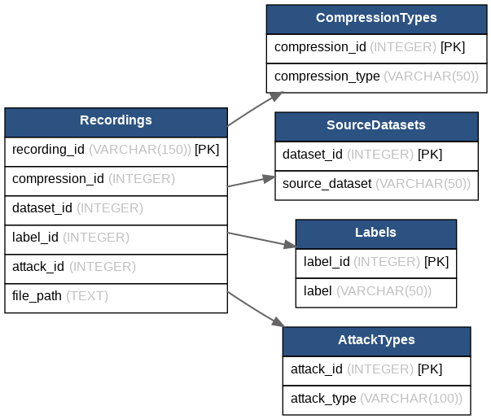

# Database

## Overview

This folder contains the database resources developed for the project.

The project database was implemented using **SQLite** to organize and manage the metadata associated with all audio recordings used throughout the project.

The folder also includes the **Entity-Relationship Diagram (ERD)**, which illustrates the database schema and the relationships between the different entities. The ERD served as the basis for designing and implementing the final SQLite database.

---
## Entity-Relationship Diagram (ERD)

The following diagram illustrates the database schema used to design the SQLite database.

# Folder Contents

| File | Description |
|------|-------------|
| `sql_database.ipynb` | Notebook used to create and populate the SQLite database. |
| `final_voice_project.db` | Final SQLite database containing the project metadata. |
| `my_final_erd.png` | Entity-Relationship Diagram (ERD) used to design the database schema. |
| `erd_final.png` | Screenshot of the implemented SQLite database. |

---

# Database Structure

The database consists of five related tables designed to organize the metadata of every recording used in the project.

## 1. Recordings

The **Recordings** table is the central table in the database. Each row represents a single audio recording.

| Field | Description |
|------|-------------|
| `recording_id` | Unique identifier of the recording. |
| `compression_id` | References the compression method used for the recording. |
| `dataset_id` | References the source dataset from which the recording originated. |
| `label_id` | References the recording label (Real or Spoof). |
| `attack_id` | References the spoofing attack type associated with the recording. |

---

## 2. CompressionTypes

Stores the compression method associated with each recording.

| Field | Description |
|------|-------------|
| `compression_id` | Unique identifier of the compression method. |
| `compression_type` | Compression format applied to the recording. |

---

## 3. SourceDatasets

Stores the origin of each recording included in the project.

| Field | Description |
|------|-------------|
| `dataset_id` | Unique identifier of the source dataset. |
| `source_dataset` | Name of the dataset from which the recording was obtained. |

---

## 4. Labels

Stores the ground-truth class assigned to each recording.

| Field | Description |
|------|-------------|
| `label_id` | Unique identifier of the label. |
| `label` | Recording class (Real or Spoof). |

---

## 5. AttackTypes

Stores the spoofing attack category associated with each fake recording.

| Field | Description |
|------|-------------|
| `attack_id` | Unique identifier of the attack type. |
| `attack_type` | Spoofing attack category (e.g., Neural Vocoder, Traditional Vocoder, Waveform Concatenation, ElevenLabs, or Unknown). |

---

# Entity Relationships

The **Recordings** table serves as the central entity in the database and maintains relationships with all other tables.

Each recording is linked to:

- one source dataset;
- one compression method;
- one class label;
- one spoofing attack type.

This normalized database design minimizes data duplication, improves consistency, and simplifies future maintenance and analysis.

---

# Purpose of the Database

The database was developed to:

- organize the metadata of all recordings used throughout the project;
- maintain relationships between recordings and their associated attributes;
- support efficient querying and future data analysis;
- provide a structured representation of the datasets used during the data preparation stage.

